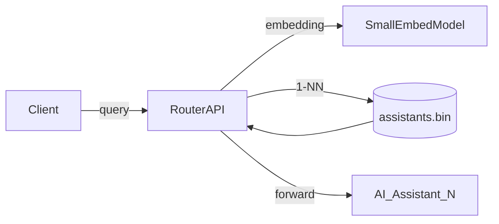

# Product Requirements Document – AI Assistant Router

## 1. Purpose

Build a lightweight, sub-5 ms router that directs each incoming user query to the most relevant specialized AI assistant by doing an approximate-nearest-neighbor (ANN) search over sentence-level embeddings stored in an **hnswlib** index.

## 2. Goals & Success Metrics

* **Latency** ≤ 5 ms at P95 for `route(query)` end-to-end.
* **Accuracy** ≥ 95 % correct assistant selection in regression tests.
* **Cold-start** (process boot) load time ≤ 150 ms.
* **Zero-downtime** rolling updates when a new index is shipped.

## 3. Scope

### In

* Building & saving the ANN index off-line.
* Loading the index into memory at service start.
* REST/HTTP endpoint `POST /route`.
* CLI utilities for rebuilding the index.
* Docker-based deployment.

### Out

* Assistant implementation details.
* Full-blown vector DB integration (future work).

## 4. System Overview



* **SmallEmbedModel** – `mixedbread-ai/mxbai-embed-large-v1` (384-dim) via `sentence-transformers`.
* **Index file** – `assistants.bin`, created by `build_index.py` using hnswlib.

## 5. Functional Requirements

| ID  | Description                                                                                                 |
| --- | ----------------------------------------------------------------------------------------------------------- |
| F-1 | CLI script `build_index.py` ingests assistant metadata → embeds → `assistants.bin`.                         |
| F-2 | Docker image contains `assistants.bin` and environment variable `INDEX_PATH`.                               |
| F-3 | On start-up, service calls `index.load_index(INDEX_PATH, max_elements=0)` and `index.set_ef(50)`.           |
| F-4 | Endpoint `POST /route` accepts JSON `{"query": <str>}` and returns `{assistant_id, name, url, similarity}`. |
| F-5 | If similarity < `THRESHOLD` (env var, default 0.35) return fallback object.                                 |
| F-6 | Health probe `GET /health` returns 200 if index is resident.                                                |
| F-7 | Build pipeline runs `make build-index && docker build` whenever assistant list YAML is modified.            |

## 6. Non-Functional Requirements

* **Performance**: see Goals.
* **Reliability**: two replicas behind a load balancer; graceful shutdown.
* **Security**: No persistence of query text; HTTPS termination at gateway.
* **Observability**: Prometheus metrics for latency, similarity score distribution, miss-rate.
* **Compatibility**: Python 3.12, hnswlib ≥ 0.8.0, Alpine-based Docker image.

## 7. Data & Config

| Item                  | Format                                     | Location                        |
| --------------------- | ------------------------------------------ | ------------------------------- |
| Assistant definitions | `assistants.yaml`                          | source repo `/data/`            |
| Embeddings            | Float32 np.array                           | ephemeral during build          |
| Index file            | `assistants.bin`                           | baked into image (`/app/data/`) |
| Runtime env           | `INDEX_PATH`, `SIM_THRESHOLD`, `EF_SEARCH` | k8s ConfigMap                   |

## 8. Deployment & Update Flow

1. Commit change to `assistants.yaml`.
2. CI runs `build_index.py` ➜ new `assistants.bin`.
3. `docker build` embeds new file, tags image.
4. CD performs rolling update; old pods drained after new pods pass `/health`.

## 9. Public API Contract

```http
POST /route
Content-Type: application/json
{
  "query": "How do I fix my GitHub Actions YAML?"
}
→ 200 OK
{
  "assistant_id": 2,
  "name": "DevOpsBot",
  "url": "http://devops:8000",
  "similarity": 0.78
}
```

## 10. Open Questions

* Should `ef`, `M`, `threshold` be tunable at runtime via admin API?
* Do we need a warm-up endpoint for embedding model?

## 11. Risks & Mitigations

| Risk                        | Impact        | Mitigation                                         |
| --------------------------- | ------------- | -------------------------------------------------- |
| hnswlib binary format drift | Loader crash  | Pin exact version in both build & runtime.         |
| High miss-rate              | Wrong routing | Log errors; add keyword rules; retrain embeddings. |

---

*Version 0.1 — May 26 2025*
